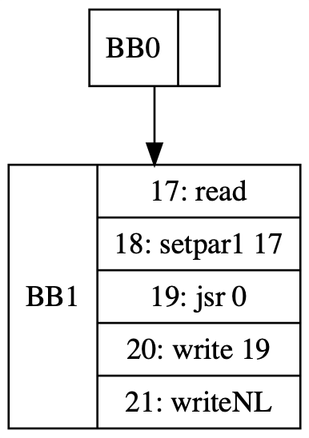
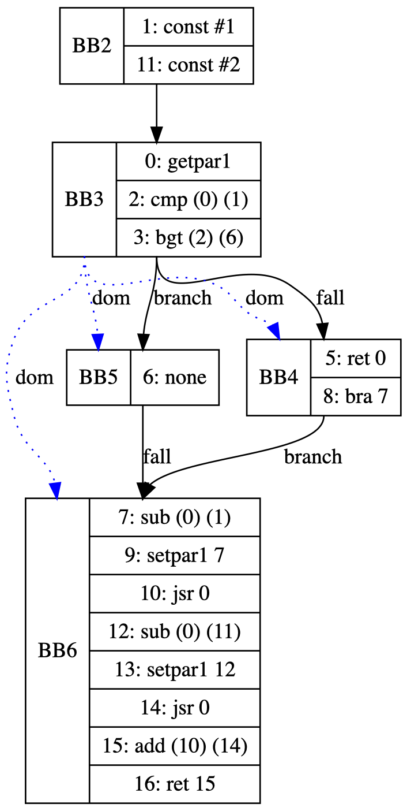

# Tiny Language Compiler

### Build
```sh
cmake -GNinja -B build -S . && ninja -C build
```

### Run
```
build/bin/ty <source_file>
```

> [!NOTE]
> Propably want to redirect stderr to /dev/null using 2>/dev/null

## Example

### Fibonacci

```c
main
var x;

function fibonacci(n); {
    if n <= 1 then
        return n
    fi;
    return call fibonacci(n - 1) + call fibonacci(n - 2)
};

{
    let x <- call InputNum;
    let x <- call fibonacci(x);
    call OutputNum(x);
    call OutputNewLine
}.
```
#### Main

#### Function

